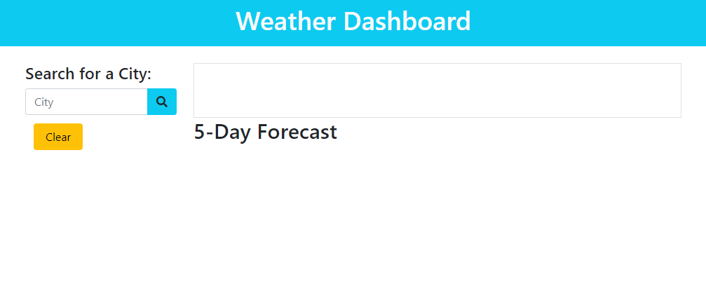
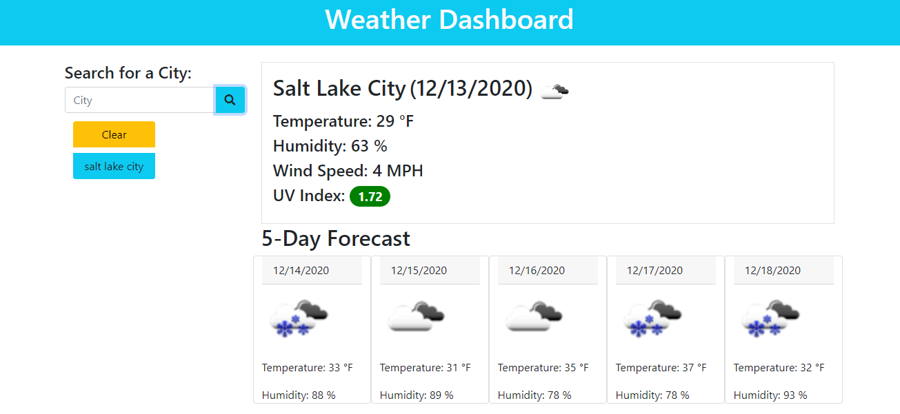

# Weather Dashboard

A website to look up current weather for cites searched. 
Website will save previous looked up location as an interaction button

## Description

* User to look up location from the input section.
* User will be able to pull up previous looked up cities.
* User will be able to clear previous looked up cities.

## Criteria

GIVEN a weather dashboard with form inputs 
WHEN I search for a city 
THEN I am presented with current and future conditions for that city and that city is added to the search history 
WHEN I view current weather conditions for that city 
THEN I am presented with the city name, the date, an icon representation of weather conditions, the temperature, the humidity, the wind speed, and the UV index 
WHEN I view the UV index 
THEN I am presented with a color that indicates whether the conditions are favorable, moderate, or severe 
WHEN I view future weather conditions for that city 
THEN I am presented with a 5-day forecast that displays the date, an icon representation of weather conditions, the temperature, and the humidity 
WHEN I click on a city in the search history 
THEN I am again presented with current and future conditions for that city 

## Screenshots

## Badges

  

## Deployment

[Weather Dashboard](https://matthewdamron.github.io/weather-dashboard/)